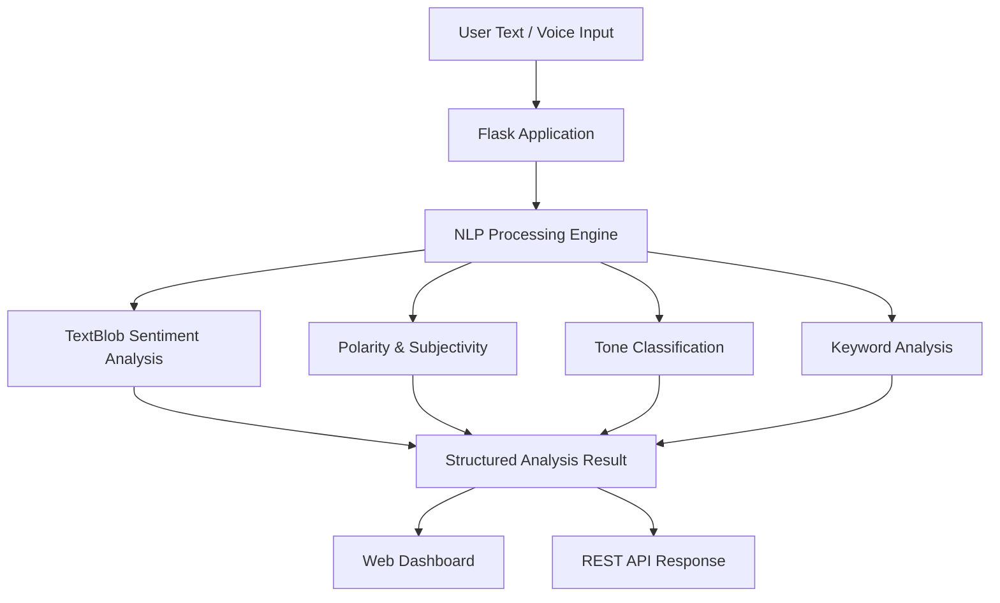

# 🧠 Sementic.ai

### Intelligent Natural Language Sentiment & Emotion Analytics

Sementic.ai is a full-stack **Natural Language Processing (NLP)** web application that analyzes text and provides sentiment, polarity, subjectivity, emotional tone, and keyword-level insights.

It is designed for analyzing **customer reviews, feedback, social media content, news, and other textual data** through an interactive and user-friendly interface.


---

## 📌 Table of Contents

* [Overview](#-overview)
* [Key Features](#-key-features)
* [How It Works](#-how-it-works)
* [Project Structure](#-project-structure)
* [Installation](#-installation)
* [Running the Application](#-running-the-application)
* [REST API](#-rest-api)
* [Tech Stack](#-tech-stack)
* [Use Cases](#-use-cases)
* [Future Enhancements](#-future-enhancements)
* [Contributing](#-contributing)
* [License](#-license)
* [Author](#-author)

---

## 🔎 Overview

Sementic.ai converts unstructured text into meaningful emotional and sentiment-based insights.

### Example

```text
"I absolutely love this product! The quality is outstanding,
super fast delivery, and top-notch customer service."
```

The system analyzes the text and provides:

* 😊 Overall Sentiment: **Positive**
* 📊 Polarity Score
* 📝 Subjectivity Score
* 🎭 Emotional Tone
* 🔑 Positive & Negative Keywords
* ⏱️ Reading Time
* 📈 Text Statistics

---

## ✨ Key Features

### 🧠 NLP-Based Analysis

* Sentiment classification
* Polarity detection
* Subjectivity analysis
* Emotional tone classification
* Keyword-level sentiment extraction

### 🎤 Voice Features

* Speech-to-text input using the browser Web Speech API
* Text-to-speech analysis summaries

### 📊 Interactive Dashboard

* Dynamic polarity meter
* Subjectivity indicator
* Emotion/tone visualization
* Positive and negative keyword highlighting
* Word and character counters

### 💾 History & Sharing

* Recent analysis history
* Analysis data stored in browser `localStorage`
* Clear history functionality
* Copy analysis results to clipboard

### ⚡ Developer-Friendly API

* REST API for programmatic analysis
* JSON request and response format
* Easy integration with external applications and services

---

## ⚙️ How It Works



### Analysis Pipeline

1. User enters or speaks text.
2. Flask receives the request.
3. The NLP engine processes the text.
4. TextBlob calculates sentiment information.
5. Polarity and subjectivity are determined.
6. The system identifies the emotional tone.
7. Important positive and negative keywords are extracted.
8. Results are displayed through the web interface or returned through the API.

---

## 📁 Project Structure

```text
sementic/
│
├── app/
│   ├── __init__.py
│   ├── ai.py
│   └── routes.py
│
├── static/
│   ├── css/
│   │   └── style.css
│   │
│   └── js/
│       └── main.js
│
├── templates/
│   └── index.html
│
├── .gitignore
├── LICENSE
├── README.md
├── requirements.txt
├── run.py
└── start.bat
```

### Important Files

| File                   | Purpose                                 |
| ---------------------- | --------------------------------------- |
| `app/ai.py`            | Core NLP and sentiment analysis         |
| `app/routes.py`        | Web routes and REST API                 |
| `templates/index.html` | Main user interface                     |
| `static/css/style.css` | UI styling and responsive design        |
| `static/js/main.js`    | Frontend interaction and voice features |
| `run.py`               | Application entry point                 |
| `requirements.txt`     | Python dependencies                     |
| `start.bat`            | Windows setup and launcher              |

---

## 🚀 Installation

### Prerequisites

Make sure you have:

* Python **3.9 or higher**
* `pip`
* Git

### 1. Clone the Repository

```bash
git clone https://github.com/supriyapriyadarsanipradhan/sementic.git
cd sementic
```

### 2. Create a Virtual Environment

#### Windows

```bash
python -m venv venv
venv\Scripts\activate
```

#### macOS / Linux

```bash
python3 -m venv venv
source venv/bin/activate
```

### 3. Install Dependencies

```bash
pip install -r requirements.txt
```

---

## ▶️ Running the Application

Start the Flask application:

```bash
python run.py
```

The application will be available at:

```text
http://localhost:8080
```

### Windows Quick Start

Windows users can also run:

```text
start.bat
```

This provides a convenient way to install dependencies and start the application.

---

## 🔌 REST API

Sementic.ai provides a REST API for programmatic sentiment analysis.

### POST `/api/analyze`

Analyze sentiment, tone, subjectivity, and keywords from text.

### Request

```http
POST /api/analyze
Content-Type: application/json
```

```json
{
  "text": "The user experience is exceptionally smooth and fast."
}
```

### Response

```json
{
  "label": "POSITIVE",
  "emoji": "🤩",
  "polarity": 0.85,
  "polarity_percentage": 85.0,
  "normalized_polarity": 92.5,
  "subjectivity": 0.95,
  "subjectivity_percentage": 95.0,
  "subjectivity_label": "Subjective & Opinion-Based",
  "tone": "Strongly Positive & Enthusiastic",
  "positive_words": [
    {
      "word": "smooth",
      "score": 0.8
    }
  ],
  "negative_words": [],
  "stats": {
    "word_count": 9,
    "char_count": 52,
    "sentence_count": 1,
    "reading_time_sec": 2
  }
}
```

### Response Fields

| Field                     | Description                              |
| ------------------------- | ---------------------------------------- |
| `label`                   | Overall sentiment classification         |
| `emoji`                   | Emoji representing the detected emotion  |
| `polarity`                | Sentiment score from `-1.0` to `+1.0`    |
| `polarity_percentage`     | Polarity represented as a percentage     |
| `normalized_polarity`     | Normalized score from `0` to `100`       |
| `subjectivity`            | Score from objective to subjective       |
| `subjectivity_percentage` | Subjectivity represented as a percentage |
| `subjectivity_label`      | Human-readable subjectivity category     |
| `tone`                    | Detected emotional tone                  |
| `positive_words`          | Important positive keywords              |
| `negative_words`          | Important negative keywords              |
| `stats`                   | Text and reading-time statistics         |

---

## 💻 API Example

### cURL

```bash
curl -X POST http://localhost:8080/api/analyze \
  -H "Content-Type: application/json" \
  -d "{\"text\":\"The product quality is excellent!\"}"
```

### Python

```python
import requests

url = "http://localhost:8080/api/analyze"

payload = {
    "text": "The product quality is excellent!"
}

response = requests.post(url, json=payload)

data = response.json()

print("Sentiment:", data["label"])
print("Polarity:", data["polarity"])
print("Tone:", data["tone"])
```

### JavaScript

```javascript
const analyzeText = async (text) => {
    const response = await fetch(
        "http://localhost:8080/api/analyze",
        {
            method: "POST",
            headers: {
                "Content-Type": "application/json"
            },
            body: JSON.stringify({ text })
        }
    );

    const data = await response.json();

    console.log(data);
};
```

---

## 🎭 Sentiment Classification

| Polarity           | Tone                                | Classification |
| ------------------ | ----------------------------------- | -------------- |
| `+0.60` to `+1.00` | Strongly Positive & Enthusiastic 🤩 | Positive       |
| `+0.20` to `+0.60` | Moderately Positive & Optimistic 😊 | Positive       |
| `-0.20` to `+0.20` | Objective & Neutral 😐              | Neutral        |
| `-0.20` to `+0.20` | Balanced / Mixed 🤔                 | Neutral        |
| `-0.60` to `-0.20` | Moderately Negative & Critical 🙁   | Negative       |
| `-1.00` to `-0.60` | Strongly Negative & Frustrated 😡   | Negative       |

---

## ⌨️ User Experience

Sementic.ai includes several usability improvements:

* **Ctrl + Enter** → Analyze text
* **Cmd + Enter** → Analyze text on macOS
* **Esc** → Clear the input
* Live word and character counter
* Dynamic analysis animations
* Copy-to-clipboard feedback
* Speech input
* Text-to-speech output
* Persistent analysis history

---

## 🛠️ Tech Stack

### Backend

* Python 3.9+
* Flask
* TextBlob

### Frontend

* HTML5
* CSS3
* JavaScript ES6+
* Responsive Grid/Flexbox
* Web Speech API
* SpeechSynthesis API
* LocalStorage API

### NLP

* TextBlob
* Sentiment Analysis
* Polarity Analysis
* Subjectivity Analysis
* Keyword Sentiment Extraction

---

## 🎯 Use Cases

Sementic.ai can be used for:

* 🛍️ Product review analysis
* 💬 Customer feedback analysis
* 📱 Social media sentiment analysis
* 📰 News text analysis
* 📊 Opinion mining
* 🧑‍💼 Customer experience research
* 🔍 Basic emotional intelligence applications
* 🤖 NLP-based application development

---

## 🔮 Future Enhancements

Potential improvements include:

* [ ] Multilingual sentiment analysis
* [ ] Advanced transformer-based NLP models
* [ ] Sentiment analysis charts and dashboards
* [ ] User authentication
* [ ] Cloud database integration
* [ ] Export reports as PDF/CSV
* [ ] Advanced emotion detection
* [ ] Batch text analysis
* [ ] Deployment with a production server
* [ ] AI-powered contextual sentiment analysis

---

## 🤝 Contributing

Contributions, suggestions, issues, and feature requests are welcome.

### Contribution Steps

```bash
# Fork the repository

# Create a feature branch
git checkout -b feature/AmazingFeature

# Commit your changes
git commit -m "Add AmazingFeature"

# Push your branch
git push origin feature/AmazingFeature
```

Then open a **Pull Request** on GitHub.

---

## 📄 License

This project is distributed under the **MIT License**.

See the [`LICENSE`](LICENSE) file for more information.

---

## 👨‍💻 Author

### Supriya Priyadarshani Pradhan

GitHub:
https://github.com/supriyapriyadarsanipradhan

Repository:
https://github.com/supriyapriyadarsanipradhan/sementic

---

## ⭐ Support

If you find **Sementic.ai** useful, consider giving the repository a ⭐ on GitHub.

**Built with ❤️ using Python, Flask, JavaScript, and NLP.**
